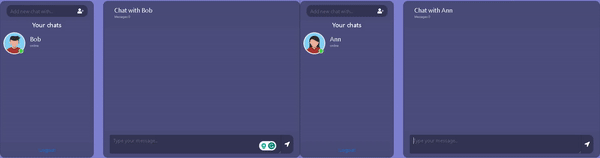

# Django Channels Chat


## Navigation
- [About project](#about-project)
- [Technologies](#technologies)
- [Installation](#installation)


## About Project
The Django Channels Chat application is a web-based chat system built using Django Channels, an extension for Django that enables WebSocket for real-time and asynchronous communication.
<hr>


## Technologies
- [Django](https://docs.djangoproject.com/)
- [Docker](https://www.docker.com/)
- [Redis](https://redis.io/)
- [PostgreSQL](https://www.postgresql.org/)
- [Django Channels](https://channels.readthedocs.io/en/latest/)

## Installation

```shell
    1) git clone https://github.com/AntonShpakovych/django-channels-chat.git
    2) cd into project root
    3) create a .env file based on .env.sample
    4) docker compose up --build
    5) http://127.0.0.1:8000/
```


## Example

